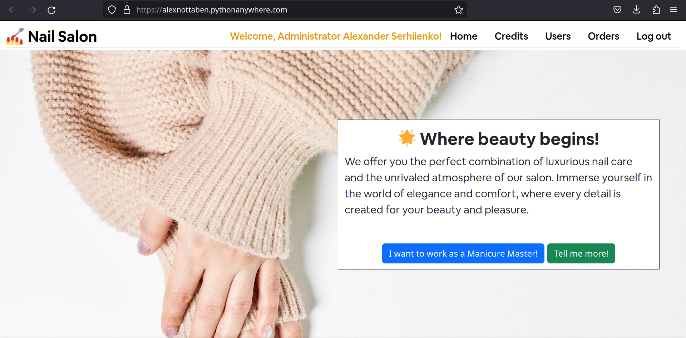
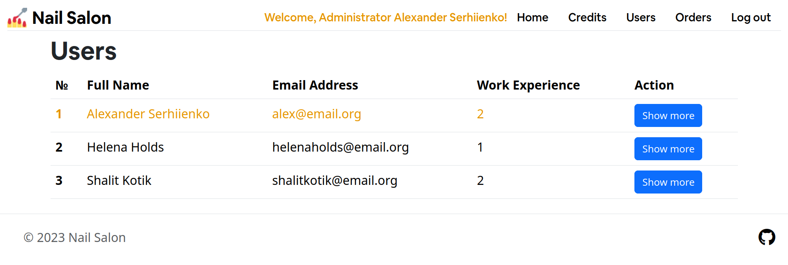
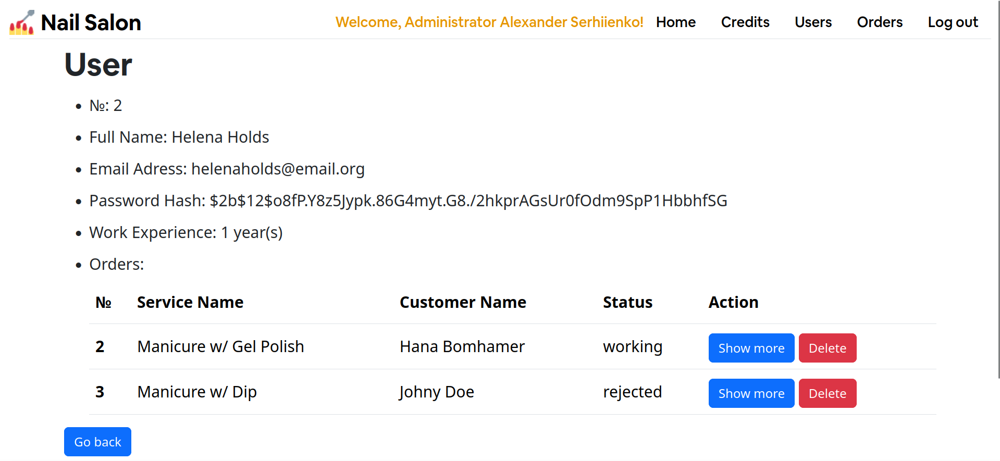
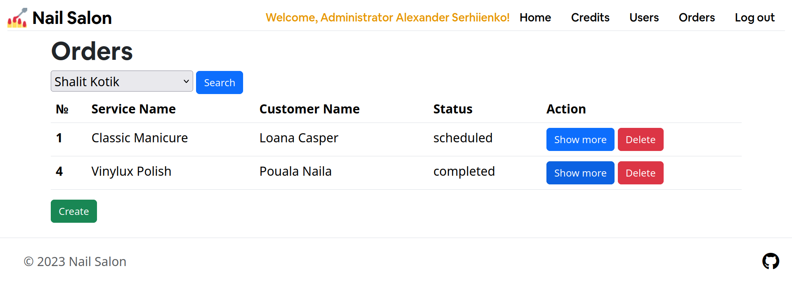
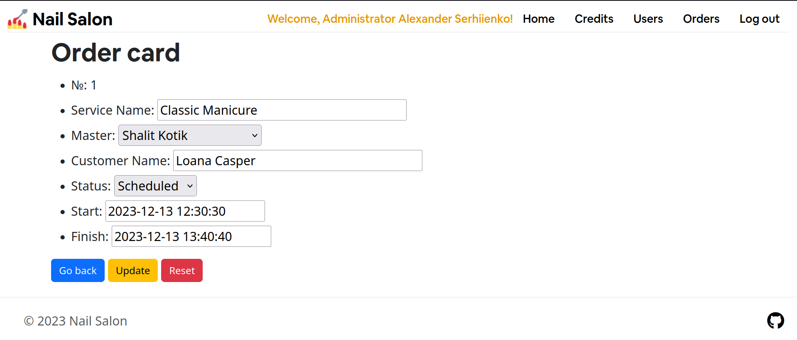
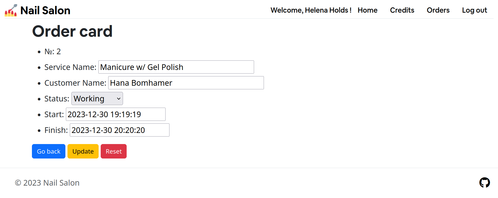

# Asden-Nail-Salon

Web application for nail salon management.
The system is available in two options for viewing - authorized users who see all the entities of the system (Administrator), and authorized users who see only their orders (Manicure master).

## [Run Live Demo](https://alexnottaben.pythonanywhere.com/)

# Screenshots

## Main page



## Users

A page with users:



A user card:




## Orders

A page with orders:



A order card:



## Orders (On behalf of the manicure master/user)

A page with orders:


A order card:



## How to run

### First clone this repository and change directory to it!

```bash
git clone https://github.com/AlexNottaBen/Asden-Nail-Salon.git
cd Asden-Nail-Salon
```

### Make virtual enviroment and install dependences!

```bash
python -m venv venv
```

Next, activate it!

For Unix-like (GNU/Linux, macOS, *BSD, Solaris etc):

```bash
source venv/bin/activate
```

For Microsoft Windows:

```powershell
venv\Scripts\activate
```

Install dependences(requirements):


```bash
pip install -r requirements.txt
```

### Set up database and run application!

Create a file ".env" and fill it in like ".env.example", indicating your URI to the database and the secret key.

Next, migrate database!

```bash
python3 migrate.py
```

Finally, run application!

```bash
python3 main.py
```

### NOTE: Use 'python' instead of 'python3' if you use Microsoft Windows.

## Credits

### Developer
Alexander Serhiienko (alias AlexNottaBen)

### Media content:

#### Favicon
This favicon was generated using the following graphics from Twitter Twemoji:
- **Graphics Author:** Copyright 2020 Twitter, Inc and other [contributors](https://github.com/twitter/twemoji).
- **Graphics Source:** [GitHub Page](https://github.com/twitter/twemoji/blob/master/assets/svg/1f485.svg).
- **Graphics License:** [CC-BY 4.0](https://creativecommons.org/licenses/by/4.0/).

Photo [Beautiful female hand with winter manicure](https://foto.wuestenigel.com/beautiful-female-hand-with-winter-manicure/) by [Marco Verch](https://linktr.ee/wuestenigel) under [CC-BY 2.0](https://creativecommons.org/licenses/by/2.0/).
